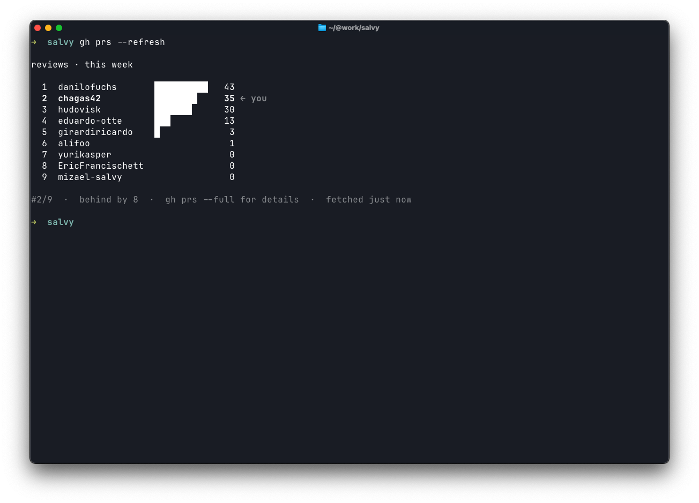
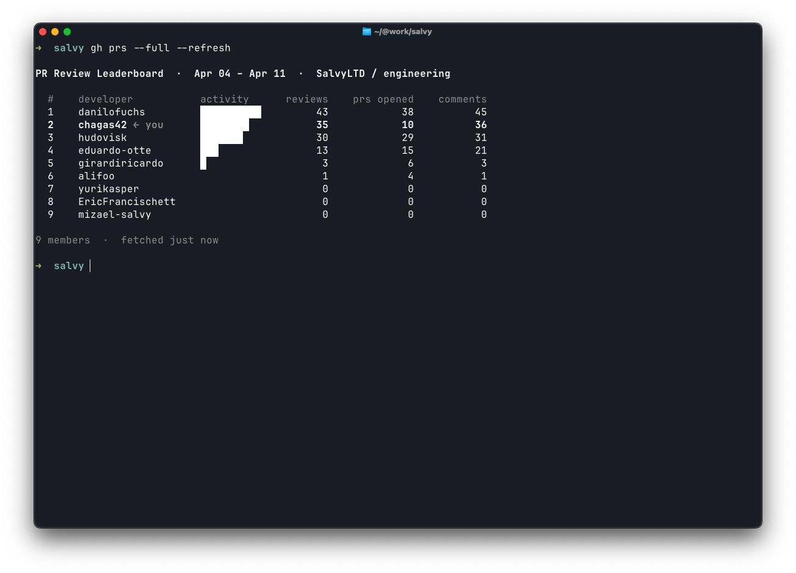
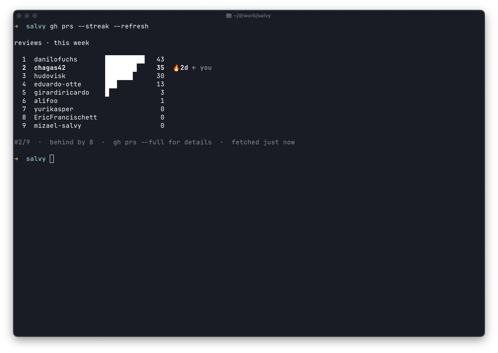

# gh-prs

[](https://www.npmjs.com/package/@chagas42/prs)
[](https://github.com/chagas42/pr-score/actions/workflows/ci.yml)
[](https://github.com/chagas42/pr-score/blob/main/LICENSE)

CLI leaderboard for GitHub PR review activity. See who's reviewing the most PRs in your org or team.

## Install

### via gh extension (recommended)

```bash
gh extension install chagas42/gh-prs
gh prs
```

No Node.js required — downloads a self-contained binary for your platform.

### via npm / npx

```bash
# no install needed
npx @chagas42/prs init
```

```bash
npm install -g @chagas42/prs
```

```bash
bun install -g @chagas42/prs
```

## Requirements

- Node.js >= 18 (or Bun >= 1.0)
- A GitHub account with access to your org

**Optional but recommended:** [GitHub CLI (`gh`)](https://cli.github.com/) — if installed and authenticated, `prs init` reuses your token and login automatically, skipping manual input.

```bash
# install gh CLI (macOS)
brew install gh
gh auth login
```

## Setup

Run once to configure your token and org:

```bash
prs init
```

You'll be prompted for:
- A GitHub token with `repo` and `read:org` scopes — if `gh` CLI is present, this is filled automatically
- Your GitHub org — fetched from your account automatically
- (Optional) a team slug — shown as a searchable list
- Your GitHub login — filled automatically from the token

Config is saved to `~/.pr-score.json`.

## Usage

```bash
# compact view (default, this week)
gh prs

# full table
gh prs --full

# different time range
gh prs --range month
gh prs --range quarter

# scope to a specific team or repo
gh prs --team frontend
gh prs --repo acme/api

# show review streaks (consecutive days)
gh prs --streak

# override config inline
gh prs --org acme-corp --team backend --me ana.lima

# force refresh (ignore cache)
gh prs --refresh
```

> If installed via npm/bun, replace `gh prs` with `prs` or `pr-score`.

### All flags

| Flag | Description | Default |
|------|-------------|---------|
| `--org <org>` | GitHub org | from config |
| `--team <team>` | Team slug | from config |
| `--repo <org/repo>` | Filter to a specific repo | — |
| `--range <range>` | `week`, `month`, or `quarter` | `week` |
| `--full` | Show full detailed table | off |
| `--me <login>` | Your GitHub login | from config |
| `--refresh` | Ignore cache and fetch fresh data | off |
| `--streak` | Show review streak (consecutive days) | off |

## Output

### Compact view · `gh prs`

<table><tr>
<td></td>
<td></td>
</tr></table>

### Full view · `gh prs --full`

<table><tr>
<td></td>
<td></td>
</tr></table>

### Streaks · `gh prs --streak`

<table><tr>
<td></td>
<td></td>
</tr></table>

## Config priority

CLI flags > environment variables > `~/.pr-score.json`

Environment variables: `GITHUB_TOKEN`, `GITHUB_ORG`, `GITHUB_TEAM`, `GITHUB_ME`

